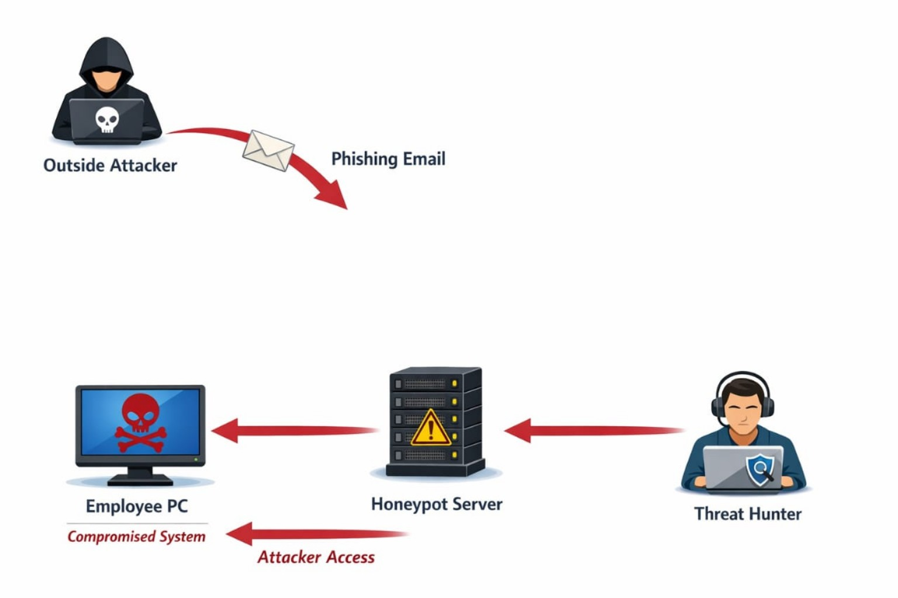

# 🛡️ Hunting the Attacker — APT Detection via Honeypots & Behavioral Analysis


---

## 📌 Overview

A hands-on lab simulating a real-world APT attack scenario — from an assumed initial compromise to full detection using **Threat Hunting techniques** and **Deception Technology**.

The lab was built to accompany a group presentation on APTs, Threat Hunting, and Honeypots — going beyond theory to demonstrate how a Threat Hunter actually thinks and works in a live environment.

> Full scenario: [docs/scenario.md](docs/scenario.md)

---

## 🎯 Objective

To demonstrate:
- How an attacker behaves **inside** a network after initial compromise
- How a Threat Hunter **proactively** detects malicious activity using behavioral analysis
- How **Honeypots** serve as high-confidence detection traps with zero false positives

---

## 🖼️ Lab Architecture



> Full setup guide: [lab-setup/vm-architecture.md](lab-setup/vm-architecture.md)

---

## 🧪 Demo Scenario

**"From Phishing to Detection — Inside a Threat Hunter Investigation"**

| Phase | Description |
|-------|-------------|
| Initial Access | Phishing-based compromise assumed — employee endpoint infected |
| Execution | Attacker gains **RCE** on internal machine |
| Reconnaissance | Internal scanning begins — attacker maps the network |
| C2 Beaconing | Attacker sends periodic messages to maintain persistence |
| Honeypot Interaction | Attacker connects to fake web server (the trap) |
| Detection | Threat Hunter detects beaconing behavior via Wireshark + logs |
| Mapping | Activity mapped to **MITRE ATT&CK** Discovery phase |

> Full attack flow: [docs/attack-flow.md](docs/attack-flow.md)

---

## 🏗️ VM Architecture

| Machine | Role | OS |
|---------|------|----|
| Victim VM/RCE | Compromised employee endpoint — attacker operates from inside this machine | Kali Linux |
| Honeypot Server | Fake web server (the trap) | Linux |
| Threat Hunter VM | Monitoring & detection workstation | Kali Linux |

All machines connected in an **isolated internal network** using VirtualBox.

---

## 🔍 Key Concepts Demonstrated

| Concept | How It Was Applied |
|---------|-------------------|
| APT Behavior | Long-term, stealthy, targeted — simulated via RCE + beaconing |
| Deception Technology | Honeypot deployed as fake internal web server |
| Threat Hunting Mindset | Behavioral analysis, not signature-based detection |
| MITRE ATT&CK Mapping | Activity mapped to Discovery & C2 techniques |
| Pyramid of Pain | Focus on TTP-level detection, not IPs or hashes |
| Network Forensics | Wireshark used to capture and analyze traffic |

---

## 🛠️ Tools Used

| Tool | Purpose |
|------|---------|
| VirtualBox | Lab environment isolation |
| Kali Linux | Attacker simulation & Threat Hunter workstation |
| Wireshark | Network traffic capture and analysis |
| Web Server (Apache/Nginx) | Honeypot simulation |
| MITRE ATT&CK | Behavior mapping & threat profiling |

---

## 🔗 Key Detection Evidence

<details>
<summary>📁 Beaconing Detection (Wireshark)</summary>

The attacker maintained C2 communication by sending periodic requests to the honeypot server.

- Regular interval requests from compromised machine
- Unusual destination (internal server with no legitimate users)
- Pattern identified as **beaconing behavior**

</details>

<details>
<summary>📁 Honeypot Access Log</summary>

Any access to the honeypot = 100% malicious activity.
No legitimate user should ever reach this server.

- Source IP: Compromised employee machine
- Request type: HTTP GET (periodic)
- Pattern: Automated, not human-driven

</details>

<details>
<summary>📁 MITRE ATT&CK Mapping</summary>

| Technique | ID | Phase |
|-----------|-----|-------|
| Phishing | T1566 | Initial Access |
| Command & Scripting Interpreter | T1059 | Execution |
| Network Service Discovery | T1046 | Discovery |
| Application Layer Protocol (HTTP) | T1071.001 | C2 |

</details>

---

## 📸 Evidence & Screenshots

| Screenshot | Description |
|-----------|-------------|
| [implementation-lab.png](screenshots/implementation-lab.png) | Attacker VM (nmap scan) + Wireshark side by side — live lab capture |
| [lab-demo.jpg](screenshots/lab-demo.jpg) | Demo scenario diagram — Phishing → Honeypot → Threat Hunter |

> Full detection analysis: [evidence/detection-results.md](evidence/detection-results.md)
---

## ⚠️ Challenges & Solutions

| Challenge | Solution |
|-----------|----------|
| Honeypot too obvious — attacker might avoid it | Deployed as a legitimate-looking internal web service on Port 80 |
| Distinguishing legitimate from malicious traffic | Used behavioral patterns (timing, frequency) not just IPs |
| No phishing simulation | Assumed breach mindset — focused on post-compromise detection |
| Beaconing blends with normal traffic | Identified fixed-interval pattern as key indicator |

---

## 📂 Project Structure

```
apt-threat-hunting-lab/
├── README.md                        → Project overview (you are here)
├── screenshots/
│   ├── implementation-lab.png       → nmap scan + Wireshark live capture
│   └── lab-demo.jpg                 → Demo scenario diagram
│
├── docs/
│   ├── scenario.md                  → Full attack scenario
│   ├── attack-flow.md               → Step-by-step attack flow
│   ├── detection.md                 → Detection methodology
│   └── lessons-learned.md           → Key takeaways
│
├── lab-setup/
│   ├── vm-architecture.md           → VM setup & network config
│   ├── tools-used.md                → Tools & versions
│   └── setup-guide.md               → How to replicate the lab
│
├── evidence/
│   ├── attacker-activity.md         → Observed attacker behavior
│   └── detection-results.md         → Final detection report
│
└── presentation/
    └── APT-Threat-Hunting.pdf       → Original group presentation
```

---

## 📚 Key Learnings

- **Assume breach** — detection starts after the attacker is already inside
- **Behavior reveals attackers** — timing, patterns, and destinations matter more than signatures
- **Honeypots provide zero false positives** — any interaction is guaranteed malicious
- **MITRE ATT&CK turns events into intelligence** — mapping behavior gives context
- **Threat Hunting is a mindset**, not just a set of tools

---

## 🚀 Future Improvements

- [ ] Add **SIEM integration** (Splunk or ELK) for centralized log analysis
- [ ] Deploy **Sysmon** on victim machine for process-level monitoring
- [ ] Simulate full **Cyber Kill Chain** — including phishing email delivery
- [ ] Add **automated alerting** when honeypot is accessed
- [ ] Expand to **multi-stage APT** simulation with lateral movement

---

## 📄 Documentation

| Document | Description |
|----------|-------------|
| [scenario.md](docs/scenario.md) | Full attack scenario & context |
| [attack-flow.md](docs/attack-flow.md) | Step-by-step attack breakdown |
| [detection.md](docs/detection.md) | Detection methodology & tools |
| [lessons-learned.md](docs/lessons-learned.md) | Key takeaways |
| [vm-architecture.md](lab-setup/vm-architecture.md) | Lab setup & VM config |
| [setup-guide.md](lab-setup/setup-guide.md) | How to replicate the lab |
| [detection-results.md](evidence/detection-results.md) | Final detection report |

---

## 📅 Project Timeline

| Milestone | Date |
|-----------|------|
| Presentation Delivered | February 12, 2026 |
| Lab Implemented & Documented | February 2026 |
| Uploaded to GitHub | April 2026 |

---

## 👥 Team

This lab was built as part of a group presentation on APTs, Threat Hunting & Deception Technology.

| Member | Role |
|--------|------|
| **Youssef Hanna** | Demo Design & Lab Implementation |
| Fagr Hassan | Presentation & Research |
| Faten Mahmoud | Presentation & Research |
| Seif Amged | Presentation & Research |
| Ismail Maher | Presentation & Research |

> Special thanks to **Eng. Mohammed Ibrahim** for guidance and continuous support.

---

## 👨‍💻 Author

**Youssef Hanna**

> Designed and implemented the hands-on threat hunting lab — simulating a real APT attack scenario from assumed compromise to detection using deception technology and behavioral analysis.

[](https://www.linkedin.com/in/youssef-hanna-29759433a/)
[](https://github.com/youssefhanna-cs)

---

[](https://github.com/youssefhanna-cs/Hunting-the-Attacker-APT-Detection-via-Honeypots-Behavioral-Analysis)

*⭐ If you found this useful, give it a star!*
